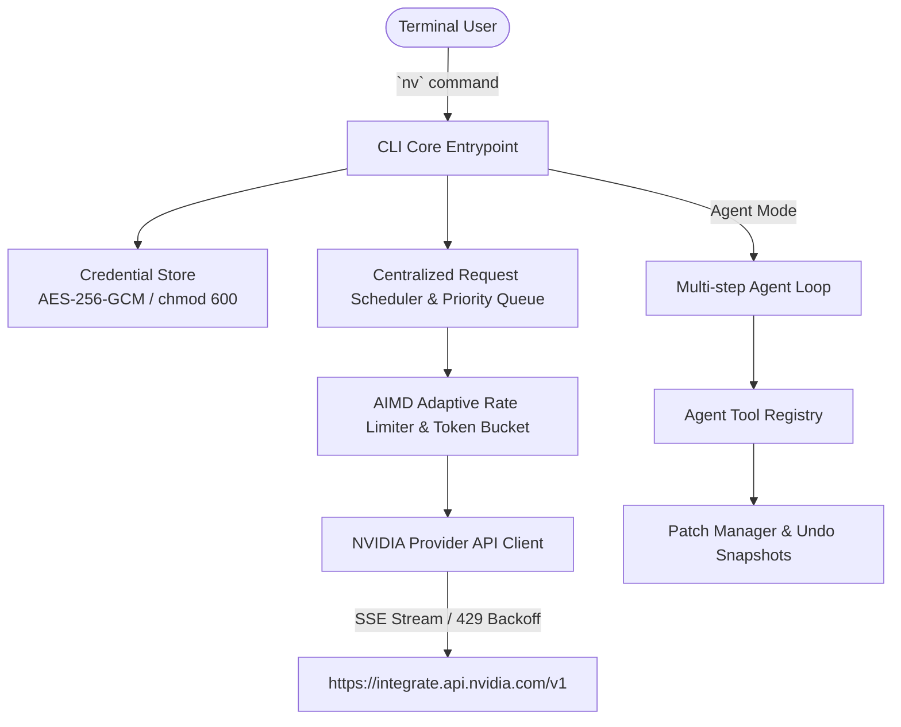

<div align="center">

# ⚡ NV — NVIDIA Terminal AI Agent

**NVIDIA Build / NIM API 기반의 고성능 대화형 Terminal AI 에이전트 CLI**

[](https://nodejs.org/)
[](https://www.typescriptlang.org/)
[](https://vitest.dev/)
[](https://build.nvidia.com)
[](./package.json)

<p align="center">
  Claude Code, Codex CLI, Agy와 같이 터미널 환경에서 완벽하게 작동하는 독립형 AI CLI 도구입니다.<br />
  NVIDIA Build API의 최첨단 LLM (Nemotron, Llama 3.3, DeepSeek R1)을 활용하며, <strong>중앙 요청 스케줄러 & AIMD 적응형 Rate Limiter</strong>를 내장하여 HTTP 429 감지 및 자동 재시도를 완벽하게 처리합니다.
</p>

</div>

---

## 📑 목차 (Table of Contents)

1. [✨ 주요 특징 (Features)](#-주요-특징-features)
2. [🏗️ 아키텍처 구조 (Architecture)](#️-아키텍처-구조-architecture)
3. [⚡ Rate Limit & 요청 스케줄러 (Rate Limiting)](#-rate-limit--요청-스케줄러-rate-limiting)
4. [🚀 빠른 시작 가이드 (Quick Start)](#-빠른-시작-가이드-quick-start)
5. [🔑 인증 및 자격 증명 관리 (Authentication)](#-인증-및-자격-증명-관리-authentication)
6. [📖 상세 사용법 (Usage Guide)](#-상세-사용법-usage-guide)
7. [⚡ Slash Commands 완벽 레퍼런스](#-slash-commands-완벽-레퍼런스)
8. [🛡️ 보안 및 안전 정책 (Security & Safety)](#️-보안-및-안전-정책-security--safety)
9. [🧪 개발 및 테스트 (Development & Testing)](#-개발-및-테스트-development--testing)

---

## ✨ 주요 특징 (Features)

- ⚡ **단일 명령어 바이너리**: 어디서나 `nv` 한 단어로 실행되는 경량 CLI
- 🎛️ **AIMD 적응형 Rate Limiter**: HTTP 429 감지 시 동시성 25% 즉시 축소, 25회 연속 성공 시 동시성 자동 복구 (Cascade Dampening 내장)
- ⏳ **중앙 요청 스케줄러 (Centralized Scheduler)**: 우선순위 큐(`interactive` > `agent` > `background` > `maintenance`) 기반 API 요청 통제
- 🔐 **하드웨어/운영체제 레벨 자격 증명 보안**: AES-256-GCM 로컬 암호화 및 `chmod 600` 제한된 권한 파일 저장소
- 🙈 **실시간 API Key 마스킹 (Redaction)**: 모든 로그, 화면 출력 및 에러 메시지에서 비밀값 자동 은폐
- 🛠️ **안전한 코딩 에이전트 도구**: 프로젝트 디렉터리 내 파일 읽기/쓰기, 명령어 실행 및 Path Traversal 차단
- ⏪ **패치 스냅샷 & `/undo` 지원**: AI가 수정한 파일들을 개별 스냅샷으로 백업하여 언제든 안전하게 원복

---

## 🏗️ 아키텍처 구조 (Architecture)



---

## ⚡ Rate Limit & 요청 스케줄러 (Rate Limiting)

NVIDIA Build 무료 엔드포인트의 Rate Limit을 안정적으로 처리하기 위한 내장 제어 시스템입니다.

- **기본 안전값**: `30 RPM` (최대 `36 RPM` 상한, 기본 동시성 `1`, 최대 동시성 `2`)
- **HTTP 429 처리**:
  - `Retry-After` 헤더(초 단위 또는 HTTP Date)를 수신하여 대기
  - 헤더 미제공 시 Exponential Backoff (2s, 4s, 8s, 16s, 32s, max 60s) + Jitter 적용
  - 동시성을 25% 즉시 감축하며 세션이나 대화를 끊지 않고 Queue에서 자동 재시도
- **Cascade Dampening**: 동시 다발 429 버스트 시 첫 번째 요청만 동시성을 감소시켜 과도한 축소를 차단

### Rate Limit 관련 명령어
```bash
# Rate limit 상태 확인
nv limits status

# 대기 중인 요청 큐 확인
nv queue

# 세션 사용량 메트릭 확인
nv usage

# 학습된 적응형 Rate limit 상태 리셋
nv limits reset
```

---

## 🚀 빠른 시작 가이드 (Quick Start)

### 1. 전제 조건 (Prerequisites)
- **Node.js**: `v22.0.0` 이상
- **패키지 매니저**: `pnpm` (권장) 또는 `npm`

### 2. 설치 및 전역 등록
```bash
# 저장소 클론 및 패키지 설치
git clone git@github-sangwookp9591:sangwookp9591/local-nv-llm.git
cd local-nv-llm
pnpm install

# 바이너리 빌드 및 시스템 PATH 등록
pnpm build
npm link
```

설치가 정상적으로 완료되었는지 확인하려면 아래 명령을 실행하세요:
```bash
nv doctor
```

---

## 🔑 인증 및 자격 증명 관리 (Authentication)

NVIDIA Build API Key는 [build.nvidia.com](https://build.nvidia.com)에서 발급받으실 수 있습니다.

```bash
# API Key 등록
nv auth login

# 인증 상태 확인
nv auth status

# 자격 증명 삭제
nv auth logout
```

---

## 📖 상세 사용법 (Usage Guide)

### 1. 대화형 TUI 모드 (Interactive Shell)
```bash
nv
```

### 2. 비대화형 파이프라인 모드 (`nv -p`)
```bash
nv -p "현재 Git diff 변경 사항을 요약해줘" > review.md
```

### 3. 코딩 에이전트 & 파일 편집 (`nv agent`)
```bash
nv agent
```

---

## ⚡ Slash Commands 완벽 레퍼런스

대화형 셸 환경에서 `/`를 입력하여 특수 명령어를 실행할 수 있습니다.

| Slash Command | 설명 |
| :--- | :--- |
| `/help` | 사용 가능한 모든 슬래시 명령어 도움말 표시 |
| `/limits` | 현재 NVIDIA Rate Limit 및 요청 제어 상태 확인 |
| `/queue` | 대기 중인 API 요청 큐 상태 확인 |
| `/usage` | 현재 세션의 API 성공/429/503 및 사용 시간 메트릭 확인 |
| `/model <id>` | 현재 대화 모델 변경 및 정보 확인 |
| `/models` | 지원되는 모델 목록 픽커 열기 |
| `/compact` | 이전 대화 맥락을 요약하여 API 컨텍스트 토큰 절약 |
| `/undo` | AI 에이전트가 최근 변경한 파일 수정 사항 되돌리기 |
| `/status` | 현재 연결, 모델, 세션 및 credential 출처 정보 표시 |
| `/clear` | 화면 및 터미널 렌더링 초기화 |
| `/exit` | NV CLI 안전하게 종료 |

---

## 🧪 개발 및 테스트 (Development & Testing)

Vitest 기반의 단위 및 통합 테스트 66개가 준비되어 있습니다.

```bash
# 전체 테스트 실행 (66개 테스트)
pnpm test

# 커버리지 리포트 생성
pnpm test:coverage

# 생산용 바이너리 빌드
pnpm build
```

---

<div align="center">

**Built with ❤️ for AI Engineers & Developers using NVIDIA Build**

</div>
