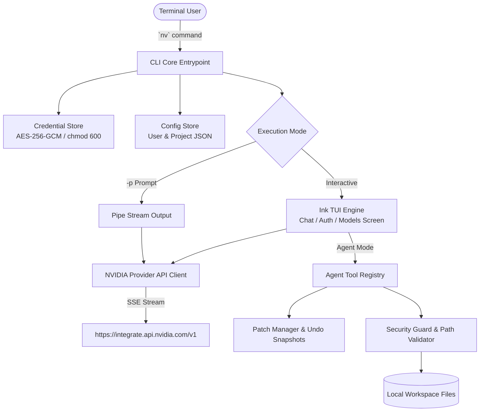

<div align="center">

# ⚡ NV — NVIDIA Terminal AI Agent

**NVIDIA Build / NIM API 기반의 고성능 대화형 Terminal AI 에이전트 CLI**

[](https://nodejs.org/)
[](https://www.typescriptlang.org/)
[](https://vitest.dev/)
[](./package.json)
[](https://build.nvidia.com)

<p align="center">
  Claude Code, Codex CLI, Agy와 같이 터미널 환경에서 완벽하게 작동하는 독립형 AI CLI 도구입니다.<br />
  NVIDIA Build API의 최첨단 LLM (Nemotron, Llama 3.3, DeepSeek R1)을 활용하여 코드 분석, 수정, 실행 및 대화를 수행합니다.
</p>

</div>

---

## 📑 목차 (Table of Contents)

1. [✨ 주요 특징 (Features)](#-주요-특징-features)
2. [🏗️ 아키텍처 구조 (Architecture)](#️-아키텍처-구조-architecture)
3. [🚀 빠른 시작 가이드 (Quick Start)](#-빠른-시작-가이드-quick-start)
4. [🔑 인증 및 자격 증명 관리 (Authentication)](#-인증-및-자격-증명-관리-authentication)
5. [📖 상세 사용법 (Usage Guide)](#-상세-사용법-usage-guide)
   - [1. 대화형 TUI 모드 (Interactive Shell)](#1-대화형-tui-모드-interactive-shell)
   - [2. 비대화형 파이프라인 모드 (`nv -p`)](#2-비대화형-파이프라인-모드-nv--p)
   - [3. 코딩 에이전트 & 파일 편집 (`nv agent`)](#3-코딩-에이전트--파일-편집-nv-agent)
   - [4. 세션 복원 및 관리](#4-세션-복원-및-관리)
   - [5. 환경 진단 도구 (`nv doctor`)](#5-환경-진단-도구-nv-doctor)
6. [⚡ Slash Commands 완벽 레퍼런스](#-slash-commands-완벽-레퍼런스)
7. [🛡️ 보안 및 안전 정책 (Security & Safety)](#️-보안-및-안전-정책-security--safety)
8. [🧪 개발 및 테스트 (Development & Testing)](#-개발-및-테스트-development--testing)

---

## ✨ 주요 특징 (Features)

- ⚡ **단일 명령어 바이너리**: 어디서나 `nv` 한 단어로 실행되는 경량 CLI
- 🔐 **하드웨어/운영체제 레벨 자격 증명 보안**: AES-256-GCM 로컬 암호화 및 `chmod 600` 제한된 권한 파일 저장소
- 🙈 **실시간 API Key 마스킹 (Redaction)**: 모든 로그, 화면 출력 및 에러 메시지에서 비밀값 자동 은폐
- 🧠 **Reasoning 모델 연동 지원**: DeepSeek R1, Nemotron 등의 사고 과정(Reasoning Content)을 실시간 TUI로 시각화
- 🛠️ **안전한 코딩 에이전트 도구**: 프로젝트 디렉터리 내 파일 읽기/쓰기, 명령어 실행 및 Path Traversal 차단
- ⏪ **패치 스냅샷 & `/undo` 지원**: AI가 수정한 파일들을 개별 스냅샷으로 백업하여 언제든 안전하게 원복
- 📊 **오프라인 모델 카탈로그 Fallback**: 동적 API 조회와 함께 오프라인 시 로컬 캐시 및 번들 카탈로그 제공

---

## 🏗️ 아키텍처 구조 (Architecture)



---

## 🚀 빠른 시작 가이드 (Quick Start)

### 1. 전제 조건 (Prerequisites)
- **Node.js**: `v22.0.0` 이상
- **패키지 매니저**: `pnpm` (권장) 또는 `npm`

### 2. 설치 및 전역 등록
```bash
# 저장소 클론 및 패키지 설치
git clone git@github-sangwookp9591:sangwookp9591/local-nv-llm.git
cd local-nv-llm
pnpm install

# 바이너리 빌드 및 시스템 PATH 등록
pnpm build
npm link
```

설치가 정상적으로 완료되었는지 확인하려면 아래 명령을 실행하세요:
```bash
nv doctor
```

---

## 🔑 인증 및 자격 증명 관리 (Authentication)

NVIDIA Build API Key는 [build.nvidia.com](https://build.nvidia.com)에서 발급받으실 수 있습니다.

### API Key 등록하기 (`nv auth login`)
```bash
nv auth login
```
> 입력한 키는 마스킹 처리되어 노출되지 않으며, NVIDIA 서버에 실제 요청을 보내 유효성을 검증한 후 안전하게 저장됩니다.

### 인증 상태 확인 (`nv auth status`)
```bash
nv auth status
```
```text
Provider: NVIDIA Build
Authentication: Connected
Credential source: macOS Keychain
API Key: nvapi-****8F2A
```

### 자격 증명 삭제 (`nv auth logout`)
```bash
nv auth logout
```

---

## 📖 상세 사용법 (Usage Guide)

### 1. 대화형 TUI 모드 (Interactive Shell)

기본 대화형 화면에 진입합니다:
```bash
nv
```
- 방향키(`↑`, `↓`)로 이전 입력 히스토리 탐색
- `Ctrl+C`: 생성 취소 또는 대화 종료
- `Ctrl+L`: 화면 정리

### 2. 비대화형 파이프라인 모드 (`nv -p`)

단발성 질의나 CI/CD 파이프라인, 스크립트 연결 시 사용합니다.

```bash
# Terminal 응답 직접 출력
nv -p "현재 디렉터리의 주요 구조를 설명해줘"

# 결과를 파일로 저장
nv -p "Git diff 변경 사항을 Markdown으로 요약해줘" > review.md

# JSON 포맷 출력 (자동화 툴 연동용)
nv -p "프로젝트 아키텍처 분석" --json
```

### 3. 코딩 에이전트 & 파일 편집 (`nv agent`)

코드베이스 조작 및 파일 작성을 수행하는 에이전트 모드입니다.

```bash
# Agent 모드로 직접 진입
nv agent

# 프롬프트와 함께 비대화형 실행
nv agent -p "테스트 오류 원인을 분석하고 수정해줘"
```

> [!TIP]
> **패치 되돌리기 (`/undo`)**
> 
> AI 에이전트가 파일 수정 작업을 완료한 후, 마음에 들지 않거나 원복하고 싶다면 대화 창에 `/undo`를 입력하세요. CLI가 이전 스냅샷을 기반으로 파일들을 원본 상태로 안전하게 복구합니다.

### 4. 세션 복원 및 관리

프로젝트별 대화 내역이 자동으로 관리됩니다.

```bash
# 현재 프로젝트의 저장된 세션 목록 조회
nv sessions

# 최근 대화 세션 재개
nv resume
```

### 5. 환경 진단 도구 (`nv doctor`)

실행 환경, 권한, API 연결 상태를 한눈에 검증합니다:
```bash
nv doctor
```
```text
NV Doctor Diagnostic Tool

 ✓ Node.js v25.8.1
 ✓ Current directory is writable
 ✓ git version 2.50.1 (Apple Git-155)
 ✓ NVIDIA API Key configured (macOS Keychain)
 ✓ NVIDIA API authentication succeeded
```

---

## ⚡ Slash Commands 완벽 레퍼런스

대화형 셸 환경에서 `/`를 입력하여 특수 명령어를 실행할 수 있습니다.

| Slash Command | 설명 |
| :--- | :--- |
| `/help` | 사용 가능한 모든 슬래시 명령어 도움말 표시 |
| `/model <id>` | 현재 대화 모델 변경 및 정보 확인 |
| `/models` | 지원되는 모델 목록 픽커 열기 |
| `/compact` | 이전 대화 맥락을 요약하여 API 컨텍스트 토큰 절약 |
| `/undo` | AI 에이전트가 최근 변경한 파일 수정 사항 되돌리기 |
| `/status` | 현재 연결, 모델, 세션 및 credential 출처 정보 표시 |
| `/clear` | 화면 및 터미널 렌더링 초기화 |
| `/export` | 대화 세션 내역을 파일로 내보내기 |
| `/agent` | 읽기/쓰기/실행 권한이 있는 Agent 모드로 전환 |
| `/chat` | 파일 변경 없는 대화 전용 Chat 모드로 전환 |
| `/exit` | NV CLI 안전하게 종료 |

---

## 🛡️ 보안 및 안전 정책 (Security & Safety)

1. **Path Traversal 방지**: 프로젝트 외부 경로(`../..`) 및 Symlink 우회를 통한 시스템 파일 접근을 엄격히 차단합니다.
2. **위험 명령어 실행 차단**: `rm -rf`, `sudo`, `chmod -R`, `git reset --hard`, `git push --force` 등 파괴적인 명령어의 자동 실행을 거부합니다.
3. **API Key 유출 보증 차단**: `redactSensitiveText` 필터링 엔진이 작동하여 어떠한 로그, 오류 메시지, 세션 저장 파일에도 API Key가 절대 남아있지 않도록 보장합니다.

---

## 🧪 개발 및 테스트 (Development & Testing)

Vitest 기반의 단위 및 통합 테스트가 완벽하게 구비되어 있습니다.

```bash
# 전체 테스트 실행 (31개 테스트)
pnpm test

# 개발 모드 (Hot reload)
pnpm dev

# 생산용 바이너리 빌드
pnpm build
```

---

<div align="center">

**Built with ❤️ for AI Engineers & Developers using NVIDIA Build**

</div>
